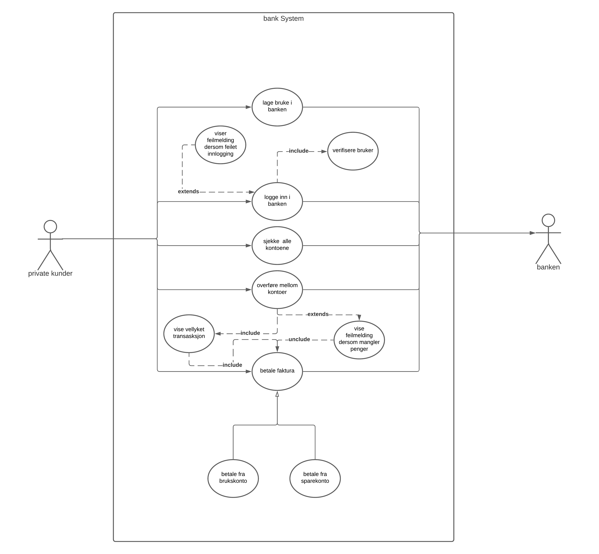
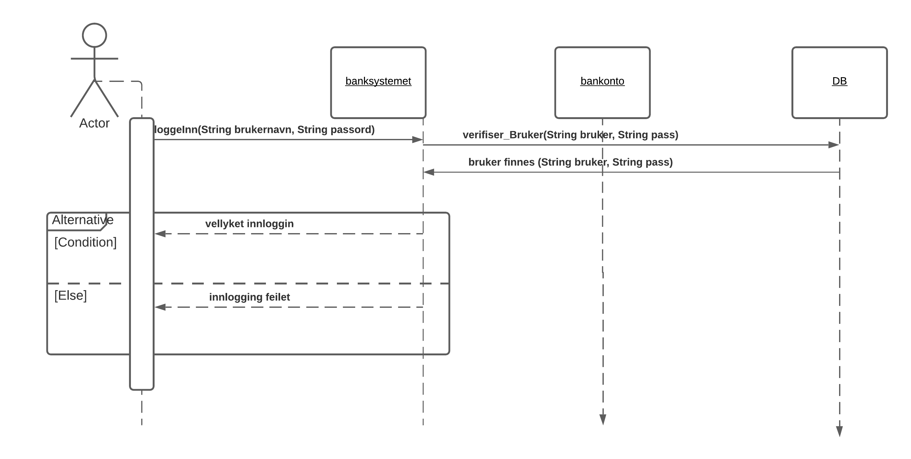
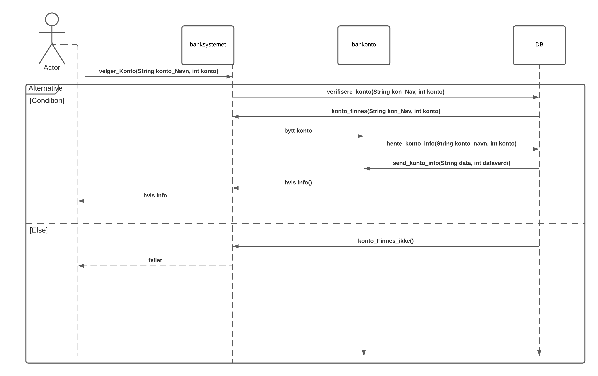
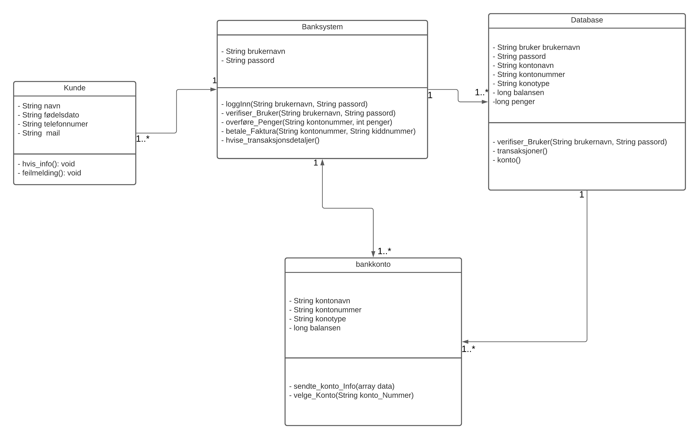

# Bank Systemet Utviklingsiden

 <h2 align ="center"> use case for the bank systemet</h2>

Her har vi laget en use case som skal vise hvordan aktørene vil samhandle med systemet.
Dette er et pekepinn på de viktigste handlingene som kunden ønsker
Vi deler use case opp i
Primæraktører 
 Private kunde som skal utføre vise handlinger i systemet
 sekundæraktører
 Banken som skal hjelpe kunden med å utføre handlingene
 

<h2 align="center">user stories for bank systemet</h2>

| User stories | Tekstlig  beskrivelse | 
| --- | --- |
|<table><tr><th> Punkter liste </th><th> User stories </th></tr><tr><td> Punkt 1 </td><td> Som privatkunde ønsker jeg å kunne logge meg inn i banken for å se kontoene min.</td></tr><tr><td> Punkt 2 </td><td>Som privatkunde ønsker jeg å kunne se på de ulike kontoene mine for å se balansenmin<td></tr><tr><td> Punkt 3 </td><td> Som privatkunde ønsker jeg å kunne se overføre penger mellom kontoene mine.</td></tr><tr><td> Punkt 4 </td><td> Som privatkunde ønsker jeg å kunne betale regningene mine ifra kontoene mine.</td></tr></table>|<table><tr><th>Innformasjon</th></tr><tr> <td> Tekstlig Beskrivelse </td> </tr> <tr> <td> Navn: logge inn i nettbanken </td></tr><tr><td> Aktør: kunde, systemet </td> </tr><tr><td> Prebetingelser: Kunden har allerede konto hos banken </td></tr><tr><td> Postbetingelser: Kunden er logget inn i banken får oversikt over alle kontoene han har i systemet </tr></table> |

| Hoved Flyte | Alternativ Flyte |
|--|--|
|<table> <tr><th>Punkt</th><th>Beskrivelse</th></tr><tr><td>punkt 1</td><td>systemet ber kunden om å legge inn brukernavnet</td></tr><tr><td>punkt 2</td><td>Kunden skriver inn brukernavnet</td></tr><tr><td>punkt 3</td><td>Systemet verifiserer brukernavnet</td></tr><tr><td>punkt 4</td><td>Systemet ber kunden om å legg inn passordet</td></tr><tr><td>punkt 5</td><td>Kunden skriver inn passordet sitt</td></tr><tr><td>punkt 6</td><td>Systemet verfifiserer passordet</td></tr><tr><td>Punkt 7</td><td>Kunden logger inn</td></td></tr> </table>|<table><tr><th> Punkt</th><th>Beskrivelse</th></tr><tr><td>Punkt 3.1</td><td>Brukernavner er feil blir sendt tilbake til punkt 2 skriver brukernavnet på nytt</td></tr><tr><td>Punkt 6.1</td><td>passordet  er feil blir sendt til punkt 4 systemet ber kunden om å skrive passordet på nytt</td></tr> </table>|

# Sekvensdiagram

# Classdiagram

